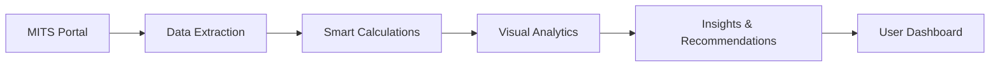

# 🎓 MITS Attendance Extension -One-Click Smart Analytics Dashboard
> ### *Smart Analytics Dashboard for MITSians*
> *Exclusively crafted for MITS students by the Department of Data Science*

---


## 🚀 Project Overview


**MITS Attendance Tracker** is a smart browser extension designed exclusively for MITS students! 🏫 Say goodbye to manual attendance — access quick, easy-to-understand reports that help you stay on top of your studies. 

Developed with care by the Data Science Department, this tool empowers over 2,500 MITS students to view their attendance in real time, predict trends, and plan for improvement — all within a simple and professional app!


> _"No more manual attendance calculations — get instant, intelligent insights that transform how you track your academic progress."_


## 🎨 UI Design Showcase

Experience the sleek and intuitive interface crafted for seamless attendance tracking.

|  |  |  |
|:-------------------------------------------------------------------------------------------------:|:---------------------------------------------------------------------------------------------------------:|:-------------------------------------------------------------------------------------------------------:|
| **Dashboard View**                                                                               | **Attendance Analytics with Bar Chart**                                                                  | **Attendance Analytics with Pie Chart**                                                                |

|  |  |  |
|:-----------------------------------------------------------------------------------------------------:|:-------------------------------------------------------------------------------------------------:|:----------------------------------------------------------------------------------------------------------:|
| **Recovery Planning**                                                                               | **One-Click CSV Export**                                                                           | **View Analytics Button**                                                                                   |


## ✨ Core Features

| Feature                        | Description                                                                 |
|-------------------------------|-----------------------------------------------------------------------------|
| 📊 **Smart Analytics Engine** |                                                                             |
| Real-time Calculation         | Instantly shows attendance percentage as data is fetched                    |
| Subject-wise Breakdown        | Gives a detailed view for each subject's attendance                         |
| AI-Powered Trend Analysis     | Predicts future attendance trends with smart algorithms                     |
| Critical Alerts               | Notifies students when attendance falls below 65%                           |
| Predictive Recovery Planning  | Suggests optimal class attendance plan to improve stats                     |
| 🎨 **Premium User Experience**|                                                                             |
| Theme Persistence             | Supports Dark/Light modes that remember your preference                     |
| Responsive Design             | Works flawlessly across mobiles, tablets, and desktops                      |
| Smooth UI Animations          | Enhances user interaction with clean transitions and effects                |
| Interactive Visuals           | Uses dynamic charts for easy data interpretation                            |
| One-click CSV Export          | Allows users to export attendance reports instantly                         |


---

## 🛠️ Technical Excellence

| Technology / Concept       | Description                                                                 |
|----------------------------|-----------------------------------------------------------------------------|
| 🧩 JavaScript (ES6+)        | Core scripting language for building logic and interactivity                |
| 🎨 CSS3 (Flexbox & Grid)    | Responsive, modern layout and styling system                               |
| 🧱 Zero-dependency Design   | Lightweight architecture with no external libraries                        |
| ⚡ Optimized DOM Handling   | Performance-tuned for minimal reflows and repaints                         |
| 💾 Local Storage            | Stores attendance data securely in browser memory                          |
| 📊 Custom SVG Graphics      | Visualizes analytics through handcrafted scalable vector visuals            |
| 🧾 manifest.json            | Defines Chrome Extension metadata, permissions, and background scripts     |


---


## 🎯 How It Works

### **Intelligent Processing Pipeline**



### 🧠 Core Algorithm

```
  `Percentage = (Total Classes Attended / Total Classes Conducted) × 100`  
  `Recovery Needed = Math.ceil((0.75 × Total Classes - Attended Classes) / 0.25)`  
  `Status = Percentage ≥ 75 ? "Safe" : "Needs Improvement"`  
```


---

## 📊 Feature Showcase

<table>
<tr>
<td align="center" width="33%">

### 📈 **Real-Time Analytics**
Instant attendance percentage calculation with subject-wise breakdown and trend analysis

</td>
<td align="center" width="33%">

### 🎯 **Recovery Planning**  
Smart algorithm calculates exact classes needed to reach 75% attendance threshold

</td>
<td align="center" width="33%">

### 📊 **Visual Insights**
Interactive charts, progress rings, and data visualizations for better understanding

</td>
</tr>
</table>

---

## 🎓 Core Benefits for MITSians

| **Benefit**        | **What You Get**                                                                                  |
|--------------------|-------------------------------------------------------------------------------------------------|
| ⏰ Time-Saving      | No more manual calculations — check your attendance instantly with a single click               |
| 🎯 Goal Tracking    | Clear progress tracking towards the crucial 75% attendance benchmark                             |
| 📊 Data-Driven      | Instant feedback on your current attendance percentage to make smart decisions                   |
| 🔄 Recovery Planning| Personalized guidance on how many classes to attend to get back on track                         |
| 🚫 Error-Free       | Zero manual errors — enjoy 100% accurate and reliable attendance tracking                        |
| ⚡ Stress-Free      | Simplified, anxiety-free attendance management for every student                                |

---

## 📥 One-Click Setup Guide

Get started in under a minute — no coding required!

### 🌐 Install on Chrome / Edge
<details>
<summary> <strong>Launch Extension in Chromium Browsers</strong></summary>

1. 🔽 **Clone or Download** this repository to your computer  
2. 🧭 Open your browser and head to `chrome://extensions/`  
3. 🛠️ Toggle on **Developer Mode** (top-right switch)  
4. 📂 Click **Load Unpacked** and choose the folder you just downloaded  
5. 🎉 You’re all set! The extension icon will appear next to your address bar  
</details>

### 🦊 Install on Firefox
<details>
<summary>  <strong>Temporary Load in Firefox for Testing</strong></summary>

1. 🔽 **Download** the extension code from this repo  
2. 🌐 Go to `about:debugging` in your Firefox browser  
3. 🔍 Choose **This Firefox** → click **Load Temporary Add-on**  
4. 📄 Select the `manifest.json` file from the extension folder  
5. ✅ Extension is now live for your current session  
</details>

>🔒 *Note: Firefox only supports temporary extensions in development mode. For persistent use, submit to Mozilla Add-ons.*


---


## Join the Journey 🤝 

We’re excited to have the `MITS community` help make this project better! 🎉🚀


- 🐞 Report Bugs: Spot a problem? Let us know!
- 💡 Suggest Features: Got ideas to improve the app? Share them!
- 🛠️ Code Improvements: Submit your code updates or fixes.
- 📖 Improve Docs: Help us make guides clearer and easier to follow.

Every bit counts. Ready to make an impact? Let’s go! 💪

 ---

## 📋 FAQ & Support

<details>
<summary><strong>❓ Is this extension safe to use?</strong></summary>
<br>
Absolutely! The extension only reads publicly available data from your MITS portal and operates entirely within your browser. No personal data is stored externally or transmitted to third parties.
</details>

<details>
<summary><strong>❓ Will this work on mobile browsers?</strong></summary>
<br>
The interface is fully responsive and mobile-optimized. However, browser extension support varies by mobile browser platform.
</details>


<details>
<summary><strong>❓ How is my data protected?</strong></summary>
<br>
Your data never leaves your browser. All calculations and storage happen locally on your device for maximum privacy and security.
</details>

---
### **🎯 Mission Statement**
> *"Helping every MITS student easily track and improve their attendance to achieve academic success with smart, easy-to-use tools."*


## 👨‍💻 Development Team

<div align="center">

### **🌟 Manoj Kumar Pendem**  
**Web Developer | Department of Data Science | MITS**

>*Passionate about leveraging technology to enhance student experiences*

[](https://github.com/Manojkumar2806) [](https://www.linkedin.com/in/manoj-kumar-pendem/) [](mailto:23691A3279@mits.ac.in)

---

❤️ Thanks for visiting! Your support means a lot. Keep shining and stay curious!

⭐ If you find this repo helpful, please give it a star!
</div>

---

</div>
